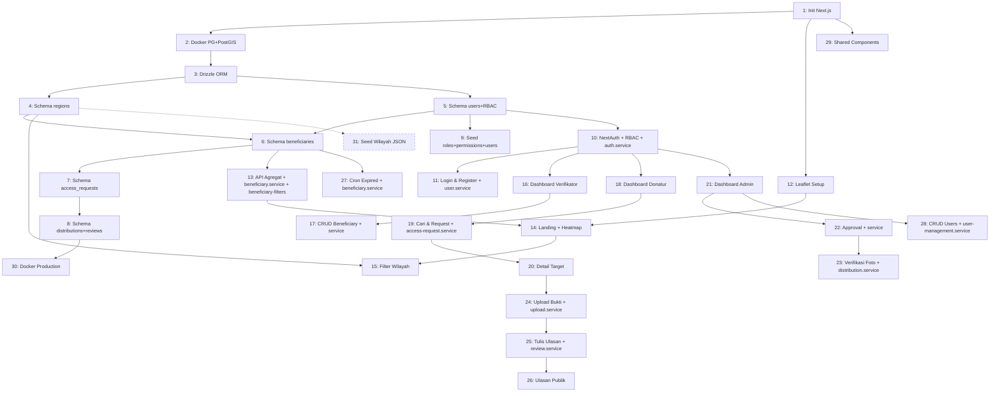

# SedekahMap — Implementation Steps

> Platform distribusi sedekah tepat sasaran berbasis peta.
> Scope awal: **Kabupaten Belitung Timur**.

## Keputusan Teknis

| Topik | Keputusan |
|-------|-----------|
| Auth | Full RBAC system (roles + permissions) menggunakan **NextAuth.js v5** + custom permission tables |
| Data Wilayah | Dari **API JSON** (akan disediakan nanti). Siapkan schema & seeder yang consume JSON |
| File Storage | **Lokal** (`public/uploads/`) |
| Scope Awal | Kabupaten Belitung Timur |
| Deploy | Docker + Docker Compose |

---

## Arsitektur Sistem (Layered Architecture)

Semua kode diorganisasi dalam 3 layer. **Aturan wajib: layer atas boleh panggil layer bawah, layer bawah TIDAK BOLEH panggil layer atas.**

```
PRESENTATION (paling atas)
  ├── src/app/api/*/route.ts        ← HTTP Controller (parse request, panggil service, format response)
  ├── src/app/(auth)/pages          ← Auth UI pages
  ├── src/app/(public)/pages        ← Public UI pages
  ├── src/app/(dashboard)/pages     ← Dashboard UI pages
  └── src/components/               ← UI Components
        ↓ boleh panggil
BUSINESS LOGIC (tengah)
  ├── src/services/*.service.ts     ← Business logic, validasi, orchestrasi DB
  ├── src/services/*-filters.ts     ← Shared query filters
  ├── src/lib/auth.ts               ← NextAuth config (pakai auth.service, bukan query langsung)
  ├── src/lib/auth-utils.ts         ← Auth helper functions
  ├── src/lib/constants.ts          ← Konstanta global
  └── src/lib/utils/*.ts            ← Utility functions
        ↓ boleh panggil
PERSISTENCE (paling bawah)
  ├── src/db/index.ts               ← Database connection
  ├── src/db/schema/*.ts            ← Table definitions & relations
  ├── src/db/seed.ts                ← Seed data
  └── src/db/seed-regions.ts        ← Region seed data
```

### Aturan per Layer

| Layer | BOLEH import dari | TIDAK BOLEH import dari |
|-------|-------------------|------------------------|
| **Presentation** (`app/api/*`, `components/*`) | `services/*`, `lib/*`, `next/server`, `next/navigation` | `@/db`, `@/db/schema/*`, `drizzle-orm`, `bcryptjs` |
| **Business Logic** (`services/*`, `lib/*`) | `@/db`, `@/db/schema/*`, `drizzle-orm`, `bcryptjs`, `lib/constants` | `next/server`, `next/navigation`, `next/headers` |
| **Persistence** (`db/*`) | Hanya `drizzle-orm`, driver DB | `services/*`, `lib/*`, `next/*` |

### Pattern Wajib untuk Setiap API Route

```typescript
// ❌ SALAH — business logic di route
// src/app/api/example/route.ts
export async function POST(req: NextRequest) {
  const body = await req.json();
  const hashedPassword = await bcrypt.hash(body.password, 12); // ← business logic di sini
  const [user] = await db.insert(users).values({...}).returning(); // ← DB query di sini
  return NextResponse.json(user, { status: 201 });
}

// ✅ BENAR — thin controller, logic di service
// src/app/api/example/route.ts
export async function POST(req: NextRequest) {
  const body = await req.json();
  const result = await exampleService.createExample(body); // ← delegasi ke service
  if (!result.success) return NextResponse.json({ error: result.message }, { status: 400 });
  return NextResponse.json(result.data, { status: 201 });
}
```

### Service File per Modul

| Modul | Service File | Fungsi Utama |
|-------|-------------|-------------|
| Auth | `src/services/auth.service.ts` | `findUserByEmail`, `getUserRolesAndPermissions`, `verifyPassword` |
| User | `src/services/user.service.ts` | `validateRegisterInput`, `registerUser` |
| Beneficiary | `src/services/beneficiary.service.ts` | `getPublicMapData`, `getPublicHeatmapData`, CRUD beneficiary |
| Beneficiary Filters | `src/services/beneficiary-filters.ts` | `activeVerifiedBeneficiaryFilter` |
| Access Request | `src/services/access-request.service.ts` | CRUD access request, approve/reject |
| Distribution | `src/services/distribution.service.ts` | CRUD distribution, verify, upload bukti |
| Review | `src/services/review.service.ts` | CRUD review, validasi double review |
| User Management | `src/services/user-management.service.ts` | CRUD user oleh admin, assign/revoke roles |
| Upload | `src/services/upload.service.ts` | Validasi file, simpan ke disk, return URL |

---

## PHASE 0: Project Setup & Infrastructure

### Step 1 — Init Project Next.js 14

Buat project Next.js 14 baru dengan App Router, TypeScript, Tailwind CSS, dan ESLint. Gunakan `src/` directory. Setup color palette brand (warna hijau islami / teal). Buat `src/lib/constants.ts` untuk konstanta global (`APP_NAME = 'SedekahMap'`, dsb).

**File target**: boilerplate Next.js, `tailwind.config.ts`, `src/lib/constants.ts`
**AC**: `npm run dev` berjalan, Tailwind berfungsi.

---

### Step 2 — Docker Compose PostgreSQL + PostGIS

Buat `docker-compose.yml` dengan service PostgreSQL 16 + PostGIS 3.4 (`postgis/postgis:16-3.4`). Buat `.env.local` dan `.env.example` dengan `DATABASE_URL`. Pastikan `.env.local` ada di `.gitignore`.

**File target**: `docker-compose.yml`, `.env.local`, `.env.example`
**AC**: Container running, `SELECT PostGIS_Version();` mengembalikan hasil.

---

### Step 3 — Setup Drizzle ORM

Install `drizzle-orm`, `postgres`, `drizzle-kit`. Buat konfigurasi Drizzle (`drizzle.config.ts`) pointing ke `src/db/schema/index.ts`. Buat file koneksi database (`src/db/index.ts`). Tambahkan npm scripts: `db:generate`, `db:migrate`, `db:push`, `db:studio`, `db:seed`.

**File target**: `drizzle.config.ts`, `src/db/index.ts`, `src/db/schema/index.ts`, `package.json`
**AC**: `npm run db:push` berjalan tanpa error.

---

## PHASE 1: Database Schema

### Step 4 — Schema: `regions`

Tabel untuk hierarki wilayah Indonesia (Provinsi > Kabupaten > Kecamatan > Desa). Kolom: `id`, `code` (kode Kemendagri, unique), `name`, `level` (1-4), `parentCode`. Data akan di-seed dari JSON di step terpisah.

**File target**: `src/db/schema/regions.ts`

---

### Step 5 — Schema: Users, Roles & Permissions (Full RBAC)

Implementasi auth database schema yang lengkap sesuai best practice RBAC:

- **`users`**: `id`, `name`, `email` (unique), `password` (hashed), `phone`, `address`, `isActive`, `emailVerifiedAt`, `createdAt`, `updatedAt`
- **`roles`**: `id`, `name` (unique, e.g. `admin`, `verifikator`, `donatur`), `description`, `createdAt`
- **`permissions`**: `id`, `name` (unique, e.g. `beneficiary:create`, `beneficiary:read`, `beneficiary:update`, `access_request:create`, `access_request:approve`, `distribution:verify`, `user:manage`, dsb), `description`, `module`, `createdAt`
- **`role_permissions`**: junction table `roleId` → `permissionId`
- **`user_roles`**: junction table `userId` → `roleId` (satu user bisa punya multiple roles)

Buat juga index yang diperlukan pada kolom-kolom yang sering di-query.

**File target**: `src/db/schema/users.ts`, `src/db/schema/roles.ts`, `src/db/schema/permissions.ts`

---

### Step 6 — Schema: `beneficiaries`

Tabel target sedekah (warga miskin). Kolom: `id`, `nik` (encrypted), `name`, `address`, `needs` (kebutuhan), `latitude`, `longitude` (double precision), `regionCode` (FK regions), `status` (enum: `verified`, `in_progress`, `completed`, `expired`), `verifiedById` (FK users), `verifiedAt`, `expiresAt` (auto 6 bulan dari verified), `createdAt`, `updatedAt`.

**File target**: `src/db/schema/beneficiaries.ts`

---

### Step 7 — Schema: `access_requests`

Tabel request akses donatur ke data detail target. Kolom: `id`, `donaturId` (FK users), `beneficiaryId` (FK beneficiaries), `intention` (niat sedekah), `status` (enum: `pending`, `approved`, `rejected`), `distributionCode` (nullable, generated saat approved, format `SDK-XXXXXX`), `reviewedById` (FK users), `reviewedAt`, `rejectionReason`, `createdAt`, `updatedAt`.

**File target**: `src/db/schema/accessRequests.ts`

---

### Step 8 — Schema: `distributions` & `reviews`

**distributions**: Mencatat penyaluran bantuan. Kolom: `id`, `accessRequestId`, `donaturId`, `beneficiaryId`, `distributionCode` (unique), `proofPhotoUrl` (nullable), `status` (enum: `pending_proof`, `pending_review`, `completed`, `rejected`), `verifiedById`, `verifiedAt`, `notes`, `createdAt`, `updatedAt`.

**reviews**: Ulasan donatur setelah penyaluran. Kolom: `id`, `distributionId`, `donaturId`, `rating` (1-5), `content`, `createdAt`.

**File target**: `src/db/schema/distributions.ts`, `src/db/schema/reviews.ts`

---

### Step 9 — Seed: Admin User, Roles, Permissions & Sample Data

Buat seeder (`src/db/seed.ts`) yang:
1. Insert semua **roles** (admin, verifikator, donatur)
2. Insert semua **permissions** yang relevan per modul (contoh: `beneficiary:create`, `beneficiary:read`, `beneficiary:update`, `access_request:create`, `access_request:approve`, `distribution:verify`, `user:manage`, dsb)
3. Assign permissions ke roles di `role_permissions`
4. Insert 1 admin (`admin@sedekahmap.id` / `admin123` hashed bcrypt), 1 verifikator sample, 1 donatur sample
5. **Jangan** seed data wilayah dulu — akan dari JSON nanti

Install `bcryptjs` untuk hashing. Tambah script `db:seed` di package.json.

**File target**: `src/db/seed.ts`, `package.json`
**AC**: Roles, permissions, dan users ter-seed. Password hashed.

---

## PHASE 2: Auth System

### Step 10 — NextAuth.js v5 + RBAC Middleware

Setup auth lengkap:

**Business Logic Layer:**
1. **Auth service** (`src/services/auth.service.ts`): Fungsi-fungsi yang mengakses DB:
   - `findUserByEmail(email)` — query users by email
   - `getUserRolesAndPermissions(userId)` — query roles + permissions (multi-table join)
   - `verifyPassword(plainText, hash)` — wrapper bcrypt.compare
2. **Auth helpers** (`src/lib/auth-utils.ts`):
   - `getCurrentUser()` — ambil user + roles + permissions dari session
   - `requireRole(role)` — throw jika role tidak sesuai
   - `requirePermission(permission)` — throw jika permission tidak ada
   - `hasPermission(user, permission)` — boolean check

**Presentation Layer:**
3. **NextAuth config** (`src/lib/auth.ts`): Credentials Provider, JWT strategy, callbacks — **import dari `auth.service.ts`**, JANGAN query DB langsung
4. **Route handler**: `src/app/api/auth/[...nextauth]/route.ts` — hanya export `handlers`
5. **Middleware** (`src/middleware.ts`): Proteksi route berdasarkan role:
   - `/admin/*` → role `admin`
   - `/verifikator/*` → role `verifikator`
   - `/donatur/*` → role `donatur`
   - `/`, `/peta` → publik

**File target**: `src/services/auth.service.ts`, `src/lib/auth.ts`, `src/app/api/auth/[...nextauth]/route.ts`, `src/middleware.ts`, `src/lib/auth-utils.ts`
**AC**: Login berfungsi, session berisi roles & permissions, route terproteksi. `auth.ts` tidak import `@/db` atau `bcryptjs`.

---

### Step 11 — Halaman Login & Register

**Business Logic Layer:**
1. **User service** (`src/services/user.service.ts`):
   - `validateRegisterInput(input)` — validasi field (nama min 2, email valid, password min 6, dll)
   - `registerUser(input)` — alur lengkap: validasi → cek email unik → hash password → insert user → assign role donatur → rollback jika role tidak ditemukan

**Presentation Layer:**
2. **Register API** (`src/app/api/auth/register/route.ts`): Thin controller — parse JSON → panggil `registerUser()` → map error code ke HTTP status
3. **Login page** (`src/app/(auth)/login/page.tsx`): Form email + password, submit via `signIn()`, redirect berdasarkan role
4. **Register page** (`src/app/(auth)/register/page.tsx`): Form lengkap, API call ke register endpoint
5. **Auth layout** (`src/app/(auth)/layout.tsx`): Layout tanpa navbar utama

UI harus menarik — card centered, gradient background, branding SedekahMap.

**File target**: `src/services/user.service.ts`, `src/app/api/auth/register/route.ts`, `src/app/(auth)/login/page.tsx`, `src/app/(auth)/register/page.tsx`, `src/app/(auth)/layout.tsx`
**AC**: Register → login → redirect ke dashboard sesuai role. Route tidak import `@/db`, `bcryptjs`, atau `drizzle-orm`.

---

## PHASE 3: Halaman Publik (Peta)

### Step 12 — Setup Leaflet + react-leaflet

Install `leaflet`, `react-leaflet`, `leaflet.heat` beserta types. Buat komponen peta dasar yang **WAJIB** di-import via `next/dynamic` dengan `ssr: false` (Leaflet butuh DOM). Center default peta di Indonesia, tile dari OpenStreetMap. Tampilkan loading skeleton saat peta loading.

> ⚠️ **CRITICAL**: Jangan pernah import Leaflet langsung di komponen Server. Selalu gunakan `dynamic(() => import(...), { ssr: false })`.

**File target**: `src/components/map/PublicMap.tsx`, `src/components/map/PublicMapWrapper.tsx`
**AC**: Peta muncul tanpa error `window is not defined`.

---

### Step 13 — API Data Agregat Peta Publik

**Business Logic Layer:**
1. **Beneficiary filters** (`src/services/beneficiary-filters.ts`):
   - `activeVerifiedBeneficiaryFilter()` — filter condition shared: `status = 'verified' AND (expiresAt IS NULL OR expiresAt > NOW())`
2. **Beneficiary service** (`src/services/beneficiary.service.ts`):
   - `getPublicMapData()` — query JOIN beneficiaries + regions, GROUP BY, ORDER BY count DESC, transformasi center coords
   - `getPublicHeatmapData()` — query lat/lng beneficiaries, terapkan privacy jitter (JITTER_RANGE=0.003), return `HeatmapPoint[]`

**Presentation Layer:**
3. **Map data API** (`src/app/api/public/map-data/route.ts`): Thin controller — panggil `getPublicMapData()` → return `{ data }`
4. **Heatmap data API** (`src/app/api/public/heatmap-data/route.ts`): Thin controller — panggil `getPublicHeatmapData()` → transform ke `number[][]` → return `{ data }`

**File target**: `src/services/beneficiary-filters.ts`, `src/services/beneficiary.service.ts`, `src/app/api/public/map-data/route.ts`, `src/app/api/public/heatmap-data/route.ts`
**AC**: Response hanya data agregat, tidak ada PII. Route tidak import `@/db` atau `drizzle-orm`.

---

### Step 14 — Landing Page + Peta Heatmap

Buat halaman utama publik:
1. **HeatmapLayer component** menggunakan `leaflet.heat`
2. **Landing page** (`/`): Hero section + peta fullwidth dengan heatmap + statistik ringkasan (total keluarga terdata, total desa, total penyaluran)
3. **Popup** saat klik area: "Terdapat X keluarga butuh bantuan di Desa Y"
4. **Layout publik**: Navbar (Logo, Beranda, Peta, Login/Register) + Footer

**File target**: `src/components/map/HeatmapLayer.tsx`, `src/app/(public)/page.tsx`, `src/app/(public)/layout.tsx`
**AC**: Heatmap muncul, popup berfungsi, tidak ada info pribadi.

---

### Step 15 — Filter Wilayah + Halaman Peta

Buat halaman peta fullscreen (`/peta`) dengan filter wilayah:
1. **Region filter component**: 4 dropdown cascading (Provinsi → Kabupaten → Kecamatan → Desa)
2. **Regions API** (`src/app/api/public/regions/route.ts`): Thin controller — query regions dari DB via service
3. **Halaman peta**: Sidebar filter + peta, zoom otomatis saat filter berubah, list ringkasan per area

> 💡 Karena query regions sederhana (hanya SELECT by level/parentCode), boleh langsung di route jika tidak ada business logic tambahan. Tapi jika ada validasi atau transformasi, extract ke service.

**File target**: `src/components/filters/RegionFilter.tsx`, `src/app/api/public/regions/route.ts`, `src/app/(public)/peta/page.tsx`
**AC**: Filter cascading berfungsi, peta zoom ke area terpilih.

---

## PHASE 4: Fitur Verifikator

### Step 16 — Dashboard Verifikator

Buat layout dashboard verifikator (protected, role `verifikator`). Sidebar: Dashboard, Input Data, Data Saya, Profile. Halaman dashboard: statistik (total input, breakdown status) + data terbaru.

**File target**: `src/app/(dashboard)/verifikator/layout.tsx`, `src/app/(dashboard)/verifikator/page.tsx`

---

### Step 17 — CRUD Beneficiary (Input Data Target Sedekah)

**Business Logic Layer:**
1. **Beneficiary service** (`src/services/beneficiary.service.ts`): Tambahkan fungsi:
   - `createBeneficiary(data, verifikatorId)` — validasi NIK unik, set `verified`, hitung `expiresAt` +6 bulan, insert ke DB
   - `getBeneficiariesByVerifikator(verifikatorId)` — list data milik verifikator, mask nama
   - `getBeneficiaryById(id)` — detail satu beneficiary
   - `updateBeneficiary(id, data)` — update data beneficiary
   - `deleteBeneficiary(id)` — soft/hard delete

**Presentation Layer:**
2. **LocationPicker component**: Peta interaktif, klik untuk pilih koordinat, tampilkan marker. Dynamic import.
3. **Beneficiaries API** (`src/app/api/verifikator/beneficiaries/route.ts`): Thin controller — POST (create) dan GET (list), delegasi ke service
4. **Beneficiary detail API** (`src/app/api/verifikator/beneficiaries/[id]/route.ts`): Thin controller — GET, PUT, DELETE
5. **Form input** (`/verifikator/input`): Nama, NIK, Alamat, Kebutuhan, Wilayah (cascading dropdown), Lokasi (map picker)
6. **Halaman data** (`/verifikator/data`): Tabel data yang sudah diinput, kolom nama di-mask.

**File target**: `src/services/beneficiary.service.ts` (update), `src/components/map/LocationPicker.tsx`, `src/app/(dashboard)/verifikator/input/page.tsx`, `src/app/api/verifikator/beneficiaries/route.ts`, `src/app/api/verifikator/beneficiaries/[id]/route.ts`, `src/app/(dashboard)/verifikator/data/page.tsx`
**AC**: Data tersimpan ke database, list hanya tampil data verifikator yang login. Route tidak import `@/db` atau `drizzle-orm`.

---

## PHASE 5: Fitur Donatur

### Step 18 — Dashboard Donatur

Buat layout dashboard donatur (protected, role `donatur`). Sidebar: Dashboard, Cari Target, Permintaan Saya, Penyaluran, Profile. Halaman dashboard: statistik + request terbaru.

**File target**: `src/app/(dashboard)/donatur/layout.tsx`, `src/app/(dashboard)/donatur/page.tsx`

---

### Step 19 — Cari Target & Request Akses

**Business Logic Layer:**
1. **Access request service** (`src/services/access-request.service.ts`): Fungsi:
   - `validateAccessRequest(input)` — validasi intention, cek beneficiary exists
   - `createAccessRequest(donaturId, beneficiaryId, intention)` — create request dengan status `pending`, cegah duplicate
   - `getAccessRequestsByDonatur(donaturId)` — list request donatur
   - `getAccessRequestDetail(id, donaturId)` — detail request + data beneficiary jika approved

**Presentation Layer:**
2. **Access requests API** (`src/app/api/donatur/access-requests/route.ts`): Thin controller — POST dan GET, delegasi ke service
3. **Access request detail API** (`src/app/api/donatur/access-requests/[id]/route.ts`): Thin controller — GET detail
4. **Halaman cari** (`/donatur/cari`): Peta dengan data agregat, klik area → popup jumlah + tombol "Minta Akses Data"
5. **Modal request**: Form niat sedekah, submit ke API
6. **Halaman list request** (`/donatur/requests`): Tabel status request

**File target**: `src/services/access-request.service.ts`, `src/app/api/donatur/access-requests/route.ts`, `src/app/api/donatur/access-requests/[id]/route.ts`, `src/app/(dashboard)/donatur/cari/page.tsx`, `src/components/modals/RequestAccessModal.tsx`, `src/app/(dashboard)/donatur/requests/page.tsx`
**AC**: Request masuk ke DB dengan status `pending`. Route tidak import `@/db` atau `drizzle-orm`.

---

### Step 20 — Detail Target Setelah Approved

**Business Logic Layer:**
1. **Access request service** (`src/services/access-request.service.ts`): Tambahkan:
   - `getAccessRequestWithBeneficiaryDetail(id, donaturId)` — jika approved, include data lengkap beneficiary (nama, alamat, koordinat presisi); jika belum, hanya status

**Presentation Layer:**
2. **DirectionMap component**: Marker target + hitung jarak dari posisi device donatur menggunakan `@turf/distance` + browser Geolocation API
3. **Halaman detail** (`/donatur/requests/[id]`): Tampil info target + Kode Penyaluran (SDK-XXX) + peta dengan marker presisi

Install `@turf/turf`.

**File target**: `src/services/access-request.service.ts` (update), `src/app/(dashboard)/donatur/requests/[id]/page.tsx`, `src/components/map/DirectionMap.tsx`
**AC**: Detail hanya muncul jika `approved`, jarak real-time dihitung.

---

## PHASE 6: Fitur Admin

### Step 21 — Dashboard Admin

Buat layout dashboard admin (protected, role `admin`). Sidebar: Dashboard, Approval Request, Verifikasi Penyaluran, Kelola User, Kelola Wilayah. Halaman dashboard: statistik global.

**File target**: `src/app/(dashboard)/admin/layout.tsx`, `src/app/(dashboard)/admin/page.tsx`

---

### Step 22 — Approval Access Request

**Business Logic Layer:**
1. **Access request service** (`src/services/access-request.service.ts`): Tambahkan:
   - `getAllAccessRequests(filters?)` — list semua request, filterable by status
   - `approveAccessRequest(id, adminId)` — generate `distributionCode` format `SDK-XXXXXX`, update status, buat record `distributions`, return distribution
   - `rejectAccessRequest(id, adminId, reason)` — update status + rejection reason
2. **Utility** (`src/lib/utils/generate-code.ts`): Generate kode unik `SDK-XXXXXX`

**Presentation Layer:**
3. **Admin access requests API** (`src/app/api/admin/access-requests/route.ts`): Thin controller — GET list
4. **Admin access request action API** (`src/app/api/admin/access-requests/[id]/route.ts`): Thin controller — PATCH approve/reject
5. **Halaman approval** (`/admin/approvals`): Tabel request + tombol Approve/Reject dengan modal konfirmasi

**File target**: `src/services/access-request.service.ts` (update), `src/lib/utils/generate-code.ts`, `src/app/api/admin/access-requests/route.ts`, `src/app/api/admin/access-requests/[id]/route.ts`, `src/app/(dashboard)/admin/approvals/page.tsx`
**AC**: Approve → kode ter-generate + record distributions terbuat. Route tidak import `@/db` atau `drizzle-orm`.

---

### Step 23 — Verifikasi Foto Bukti

**Business Logic Layer:**
1. **Distribution service** (`src/services/distribution.service.ts`): Fungsi:
   - `getDistributionsByStatus(status)` — list distributions, filterable
   - `verifyDistribution(id, adminId, approved)` — update status `completed`/`rejected`, jika completed update juga beneficiary status ke `completed`

**Presentation Layer:**
2. **Distributions API** (`src/app/api/admin/distributions/route.ts`): Thin controller — GET list pending_review
3. **Distribution action API** (`src/app/api/admin/distributions/[id]/route.ts`): Thin controller — PATCH verify/reject
4. **Halaman verifikasi** (`/admin/verifikasi`): Tabel + preview foto + tombol Terverifikasi/Tolak

**File target**: `src/services/distribution.service.ts`, `src/app/api/admin/distributions/route.ts`, `src/app/api/admin/distributions/[id]/route.ts`, `src/app/(dashboard)/admin/verifikasi/page.tsx`
**AC**: Admin bisa verifikasi foto, status ter-update. Route tidak import `@/db` atau `drizzle-orm`.

---

## PHASE 7: Penyaluran & Upload Bukti

### Step 24 — Upload Foto Bukti Penyaluran

**Business Logic Layer:**
1. **Upload service** (`src/services/upload.service.ts`): Fungsi:
   - `validateFile(file)` — cek max 5MB, tipe jpg/png/webp only
   - `saveFile(file)` — simpan ke `public/uploads/proofs/`, return URL
2. **Distribution service** (`src/services/distribution.service.ts`): Tambahkan:
   - `updateDistributionProof(code, donaturId, proofPhotoUrl, notes)` — cari by code, cek milik donatur, update `proofPhotoUrl`, set status `pending_review`

**Presentation Layer:**
3. **Upload API** (`src/app/api/upload/route.ts`): Thin controller — accept multipart, delegasi ke `uploadService.saveFile()`
4. **Distribution update API** (`src/app/api/donatur/distributions/[code]/route.ts`): Thin controller — PATCH, delegasi ke service
5. **Halaman lapor** (`/donatur/lapor`): Form Kode Penyaluran + Upload Foto + Notes, preview sebelum upload

**File target**: `src/services/upload.service.ts`, `src/services/distribution.service.ts` (update), `src/app/api/upload/route.ts`, `src/app/api/donatur/distributions/[code]/route.ts`, `src/app/(dashboard)/donatur/lapor/page.tsx`
**AC**: Foto tersimpan lokal, status berubah ke `pending_review`. Route tidak import `@/db` atau `drizzle-orm`.

---

## PHASE 8: Review & Ulasan

### Step 25 — Donatur Tulis Ulasan

**Business Logic Layer:**
1. **Review service** (`src/services/review.service.ts`): Fungsi:
   - `createReview(donaturId, distributionId, rating, content)` — validasi distribution milik donatur & status `completed`, cegah double review, insert review

**Presentation Layer:**
2. **Reviews API** (`src/app/api/donatur/reviews/route.ts`): Thin controller — POST, delegasi ke service
3. **Halaman detail penyaluran** (`/donatur/penyaluran/[id]`): Detail + form review (rating 1-5 bintang + teks) hanya jika `completed` & belum ada review

**File target**: `src/services/review.service.ts`, `src/app/api/donatur/reviews/route.ts`, `src/app/(dashboard)/donatur/penyaluran/[id]/page.tsx`
**AC**: Review tersimpan, tidak bisa double review. Route tidak import `@/db` atau `drizzle-orm`.

---

### Step 26 — Tampilkan Ulasan di Halaman Publik

**Business Logic Layer:**
1. **Review service** (`src/services/review.service.ts`): Tambahkan:
   - `getPublicReviews(limit?)` — return reviews terbaru, include nama donatur, rating, content, area. **JANGAN** include nama target/NIK/alamat.

**Presentation Layer:**
2. **Public reviews API** (`src/app/api/public/reviews/route.ts`): Thin controller — GET, delegasi ke service
3. **ReviewCard component**: Card dengan rating bintang, teks, info area
4. **Update landing page**: Tambah section "Ulasan Terbaru"

**File target**: `src/services/review.service.ts` (update), `src/app/api/public/reviews/route.ts`, `src/components/reviews/ReviewCard.tsx`, update `src/app/(public)/page.tsx`
**AC**: Ulasan tampil tanpa data pribadi target. Route tidak import `@/db` atau `drizzle-orm`.

---

## PHASE 9: Business Rules & Admin Tools

### Step 27 — Cron: Expired Data Re-Assessment

**Business Logic Layer:**
1. **Beneficiary service** (`src/services/beneficiary.service.ts`): Tambahkan:
   - `expireOverdueBeneficiaries()` — update beneficiaries yang `expiresAt < NOW()` dan status `verified` menjadi `expired`
   - `getExpiredBeneficiaryStats()` — statistik data expired untuk notifikasi dashboard

**Presentation Layer:**
2. **Cron API** (`src/app/api/cron/expire-beneficiaries/route.ts`): Thin controller — panggil service function

**File target**: `src/services/beneficiary.service.ts` (update), `src/app/api/cron/expire-beneficiaries/route.ts`
**AC**: Beneficiaries expired ter-update otomatis. Route tidak import `@/db` atau `drizzle-orm`.

---

### Step 28 — Admin: Kelola User (CRUD)

**Business Logic Layer:**
1. **User management service** (`src/services/user-management.service.ts`): Fungsi:
   - `listUsers(filters?, pagination?)` — list users dengan pagination & filter role
   - `createUser(data)` — create user (admin/verifikator), hash password, assign roles
   - `updateUser(id, data)` — edit user, update roles
   - `toggleUserActive(id)` — aktifkan/nonaktifkan user
   - `assignRoles(userId, roleIds)` — assign/revoke roles

**Presentation Layer:**
2. **Admin users API** (`src/app/api/admin/users/route.ts`): Thin controller — GET list, POST create
3. **Admin user detail API** (`src/app/api/admin/users/[id]/route.ts`): Thin controller — GET, PUT, PATCH
4. **Halaman kelola user** (`/admin/users`): Tabel users dengan pagination & action buttons

**File target**: `src/services/user-management.service.ts`, `src/app/api/admin/users/route.ts`, `src/app/api/admin/users/[id]/route.ts`, `src/app/(dashboard)/admin/users/page.tsx`
**AC**: CRUD user berfungsi, role assignment berfungsi. Route tidak import `@/db`, `bcryptjs`, atau `drizzle-orm`.

---

### Step 29 — Shared UI Components

Buat komponen UI reusable di `src/components/ui/`: Button (variants), Input (dengan label & error), Select, Modal, Table (dengan pagination), Badge (status colors), Card, Toast. Pastikan semua halaman konsisten menggunakan komponen ini.

> 💡 Step ini idealnya dimulai sejak awal dan terus di-update seiring step lain.

**File target**: `src/components/ui/*.tsx`

---

## PHASE 10: Deployment

### Step 30 — Dockerfile & Docker Compose Production

Buat `Dockerfile` multi-stage (deps → build → production). Update `docker-compose.yml` dengan service `app`. Buat `docker-compose.prod.yml` dan `.dockerignore`. Test `docker compose up --build`.

**File target**: `Dockerfile`, `docker-compose.prod.yml`, `.dockerignore`, update `docker-compose.yml`
**AC**: Seluruh aplikasi running via Docker di `localhost:3000`.

---

### Step 31 — Seed Data Wilayah dari JSON

Saat JSON data wilayah Kab. Belitung Timur sudah tersedia:
1. Buat script seeder khusus (`src/db/seed-regions.ts`) yang membaca file JSON dan insert ke tabel `regions`
2. JSON format yang diharapkan: `{ code, name, level, parentCode }`
3. Tambah npm script: `db:seed-regions`

> ⏳ Step ini menunggu data JSON disediakan oleh user.

**File target**: `src/db/seed-regions.ts`

---

## Dependency Graph



---

## Catatan untuk Executor (Programmer / AI Model)

1. **Selalu cek referensi docs** sebelum implement. Gunakan context7 jika tersedia:
   - Next.js: `query-docs("next.js", "<topik>")`
   - Drizzle: `query-docs("drizzle-orm", "<topik>")`
   - react-leaflet: `query-docs("react-leaflet", "<topik>")`
   - NextAuth: `query-docs("next-auth", "<topik>")`

2. **Leaflet CRITICAL RULE**: Selalu import via `next/dynamic` dengan `ssr: false`. JANGAN import langsung.

3. **Privasi**: Halaman publik tidak boleh menampilkan NIK, nama asli, atau alamat detail target. Koordinat di-jitter.

4. **RBAC**: Setiap API route harus check permission, bukan hanya role. Gunakan `requirePermission()`.

5. **Database**: Jalankan `npm run db:push` setelah setiap perubahan schema.

6. **LAYERED ARCHITECTURE — WAJIB**: Setiap API route HARUS mengikuti pola:
   - Route (Presentation) → Service (Business Logic) → DB (Persistence)
   - **JANGAN** import `@/db`, `@/db/schema/*`, `drizzle-orm`, atau `bcryptjs` di route file
   - **JANGAN** import `next/server` atau `next/navigation` di service file
   - Semua query DB, validasi business logic, dan orchestrasi harus di service layer
   - Route file hanya handle: parse request → panggil service → map error ke HTTP status → return response
