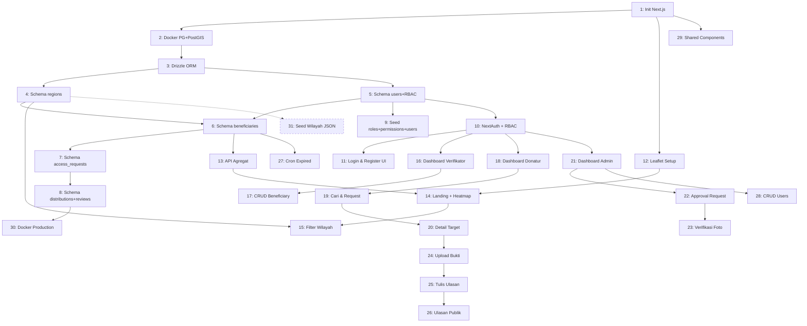

# SedekahMap — Implementation Steps

> Platform distribusi sedekah tepat sasaran berbasis peta.
> Scope awal: **Kabupaten Belitung Timur**.

## Keputusan Teknis

| Topik | Keputusan |
|-------|-----------|
| Auth | Full RBAC system (roles + permissions) menggunakan **NextAuth.js v5** + custom permission tables |
| Data Wilayah | Dari **API JSON** (akan disediakan nanti). Siapkan schema & seeder yang consume JSON |
| File Storage | **Lokal** (`public/uploads/`) |
| Scope Awal | Kabupaten Belitung Timur |
| Deploy | Docker + Docker Compose |

---

## PHASE 0: Project Setup & Infrastructure

### Step 1 — Init Project Next.js 14

Buat project Next.js 14 baru dengan App Router, TypeScript, Tailwind CSS, dan ESLint. Gunakan `src/` directory. Setup color palette brand (warna hijau islami / teal). Buat `src/lib/constants.ts` untuk konstanta global (`APP_NAME = 'SedekahMap'`, dsb).

**File target**: boilerplate Next.js, `tailwind.config.ts`, `src/lib/constants.ts`
**AC**: `npm run dev` berjalan, Tailwind berfungsi.

---

### Step 2 — Docker Compose PostgreSQL + PostGIS

Buat `docker-compose.yml` dengan service PostgreSQL 16 + PostGIS 3.4 (`postgis/postgis:16-3.4`). Buat `.env.local` dan `.env.example` dengan `DATABASE_URL`. Pastikan `.env.local` ada di `.gitignore`.

**File target**: `docker-compose.yml`, `.env.local`, `.env.example`
**AC**: Container running, `SELECT PostGIS_Version();` mengembalikan hasil.

---

### Step 3 — Setup Drizzle ORM

Install `drizzle-orm`, `postgres`, `drizzle-kit`. Buat konfigurasi Drizzle (`drizzle.config.ts`) pointing ke `src/db/schema/index.ts`. Buat file koneksi database (`src/db/index.ts`). Tambahkan npm scripts: `db:generate`, `db:migrate`, `db:push`, `db:studio`, `db:seed`.

**File target**: `drizzle.config.ts`, `src/db/index.ts`, `src/db/schema/index.ts`, `package.json`
**AC**: `npm run db:push` berjalan tanpa error.

---

## PHASE 1: Database Schema

### Step 4 — Schema: `regions`

Tabel untuk hierarki wilayah Indonesia (Provinsi > Kabupaten > Kecamatan > Desa). Kolom: `id`, `code` (kode Kemendagri, unique), `name`, `level` (1-4), `parentCode`. Data akan di-seed dari JSON di step terpisah.

**File target**: `src/db/schema/regions.ts`

---

### Step 5 — Schema: Users, Roles & Permissions (Full RBAC)

Implementasi auth database schema yang lengkap sesuai best practice RBAC:

- **`users`**: `id`, `name`, `email` (unique), `password` (hashed), `phone`, `address`, `isActive`, `emailVerifiedAt`, `createdAt`, `updatedAt`
- **`roles`**: `id`, `name` (unique, e.g. `admin`, `verifikator`, `donatur`), `description`, `createdAt`
- **`permissions`**: `id`, `name` (unique, e.g. `beneficiary:create`, `beneficiary:read`, `beneficiary:update`, `access_request:create`, `access_request:approve`, `distribution:verify`, `user:manage`, dsb), `description`, `module`, `createdAt`
- **`role_permissions`**: junction table `roleId` → `permissionId`
- **`user_roles`**: junction table `userId` → `roleId` (satu user bisa punya multiple roles)

Buat juga index yang diperlukan pada kolom-kolom yang sering di-query.

**File target**: `src/db/schema/users.ts`, `src/db/schema/roles.ts`, `src/db/schema/permissions.ts`

---

### Step 6 — Schema: `beneficiaries`

Tabel target sedekah (warga miskin). Kolom: `id`, `nik` (encrypted), `name`, `address`, `needs` (kebutuhan), `latitude`, `longitude` (double precision), `regionCode` (FK regions), `status` (enum: `verified`, `in_progress`, `completed`, `expired`), `verifiedById` (FK users), `verifiedAt`, `expiresAt` (auto 6 bulan dari verified), `createdAt`, `updatedAt`.

**File target**: `src/db/schema/beneficiaries.ts`

---

### Step 7 — Schema: `access_requests`

Tabel request akses donatur ke data detail target. Kolom: `id`, `donaturId` (FK users), `beneficiaryId` (FK beneficiaries), `intention` (niat sedekah), `status` (enum: `pending`, `approved`, `rejected`), `distributionCode` (nullable, generated saat approved, format `SDK-XXXXXX`), `reviewedById` (FK users), `reviewedAt`, `rejectionReason`, `createdAt`, `updatedAt`.

**File target**: `src/db/schema/accessRequests.ts`

---

### Step 8 — Schema: `distributions` & `reviews`

**distributions**: Mencatat penyaluran bantuan. Kolom: `id`, `accessRequestId`, `donaturId`, `beneficiaryId`, `distributionCode` (unique), `proofPhotoUrl` (nullable), `status` (enum: `pending_proof`, `pending_review`, `completed`, `rejected`), `verifiedById`, `verifiedAt`, `notes`, `createdAt`, `updatedAt`.

**reviews**: Ulasan donatur setelah penyaluran. Kolom: `id`, `distributionId`, `donaturId`, `rating` (1-5), `content`, `createdAt`.

**File target**: `src/db/schema/distributions.ts`, `src/db/schema/reviews.ts`

---

### Step 9 — Seed: Admin User, Roles, Permissions & Sample Data

Buat seeder (`src/db/seed.ts`) yang:
1. Insert semua **roles** (admin, verifikator, donatur)
2. Insert semua **permissions** yang relevan per modul (contoh: `beneficiary:create`, `beneficiary:read`, `beneficiary:update`, `access_request:create`, `access_request:approve`, `distribution:verify`, `user:manage`, dsb)
3. Assign permissions ke roles di `role_permissions`
4. Insert 1 admin (`admin@sedekahmap.id` / `admin123` hashed bcrypt), 1 verifikator sample, 1 donatur sample
5. **Jangan** seed data wilayah dulu — akan dari JSON nanti

Install `bcryptjs` untuk hashing. Tambah script `db:seed` di package.json.

**File target**: `src/db/seed.ts`, `package.json`
**AC**: Roles, permissions, dan users ter-seed. Password hashed.

---

## PHASE 2: Auth System

### Step 10 — NextAuth.js v5 + RBAC Middleware

Setup auth lengkap:
1. **NextAuth config** (`src/lib/auth.ts`): Credentials Provider, JWT strategy, callbacks yang menambahkan `userId`, `roles[]`, dan `permissions[]` ke session/token
2. **Route handler**: `src/app/api/auth/[...nextauth]/route.ts`
3. **Middleware** (`src/middleware.ts`): Proteksi route berdasarkan role:
   - `/admin/*` → role `admin`
   - `/verifikator/*` → role `verifikator`
   - `/donatur/*` → role `donatur`
   - `/`, `/peta` → publik
4. **Auth helpers** (`src/lib/auth-utils.ts`):
   - `getCurrentUser()` — ambil user + roles + permissions dari session
   - `requireRole(role)` — throw jika role tidak sesuai
   - `requirePermission(permission)` — throw jika permission tidak ada
   - `hasPermission(user, permission)` — boolean check

**File target**: `src/lib/auth.ts`, `src/app/api/auth/[...nextauth]/route.ts`, `src/middleware.ts`, `src/lib/auth-utils.ts`
**AC**: Login berfungsi, session berisi roles & permissions, route terproteksi.

---

### Step 11 — Halaman Login & Register

Buat halaman auth dengan layout sendiri (tanpa navbar utama):
1. **Login**: Form email + password, submit via `signIn()`, redirect berdasarkan role
2. **Register**: Form lengkap (nama, email, password, phone, alamat), hanya untuk donatur, API call ke register endpoint
3. **Register API**: Validasi, hash password, insert user + assign role `donatur`

UI harus menarik — card centered, gradient background, branding SedekahMap.

**File target**: `src/app/(auth)/login/page.tsx`, `src/app/(auth)/register/page.tsx`, `src/app/(auth)/layout.tsx`, `src/app/api/auth/register/route.ts`
**AC**: Register → login → redirect ke dashboard sesuai role.

---

## PHASE 3: Halaman Publik (Peta)

### Step 12 — Setup Leaflet + react-leaflet

Install `leaflet`, `react-leaflet`, `leaflet.heat` beserta types. Buat komponen peta dasar yang **WAJIB** di-import via `next/dynamic` dengan `ssr: false` (Leaflet butuh DOM). Center default peta di Indonesia, tile dari OpenStreetMap. Tampilkan loading skeleton saat peta loading.

> ⚠️ **CRITICAL**: Jangan pernah import Leaflet langsung di komponen Server. Selalu gunakan `dynamic(() => import(...), { ssr: false })`.

**File target**: `src/components/map/PublicMap.tsx`, `src/components/map/PublicMapWrapper.tsx`
**AC**: Peta muncul tanpa error `window is not defined`.

---

### Step 13 — API Data Agregat Peta Publik

Buat 2 API endpoint publik:
1. **`/api/public/map-data`**: Return jumlah beneficiaries per wilayah (GROUP BY region). Format: `{ regionCode, regionName, count, centerLat, centerLng }`. Filter hanya `verified` & belum expired. **JANGAN** return data pribadi (NIK, nama, alamat).
2. **`/api/public/heatmap-data`**: Return `[lat, lng, intensity]` untuk leaflet.heat. Koordinat harus di-**jitter** (tambah random offset kecil) agar tidak menunjuk lokasi presisi rumah.

**File target**: `src/app/api/public/map-data/route.ts`, `src/app/api/public/heatmap-data/route.ts`
**AC**: Response hanya data agregat, tidak ada PII.

---

### Step 14 — Landing Page + Peta Heatmap

Buat halaman utama publik:
1. **HeatmapLayer component** menggunakan `leaflet.heat`
2. **Landing page** (`/`): Hero section + peta fullwidth dengan heatmap + statistik ringkasan (total keluarga terdata, total desa, total penyaluran)
3. **Popup** saat klik area: "Terdapat X keluarga butuh bantuan di Desa Y"
4. **Layout publik**: Navbar (Logo, Beranda, Peta, Login/Register) + Footer

**File target**: `src/components/map/HeatmapLayer.tsx`, `src/app/(public)/page.tsx`, `src/app/(public)/layout.tsx`
**AC**: Heatmap muncul, popup berfungsi, tidak ada info pribadi.

---

### Step 15 — Filter Wilayah + Halaman Peta

Buat halaman peta fullscreen (`/peta`) dengan filter wilayah:
1. **API regions**: `/api/public/regions?level=1` atau `?parentCode=XX`
2. **Region filter component**: 4 dropdown cascading (Provinsi → Kabupaten → Kecamatan → Desa)
3. **Halaman peta**: Sidebar filter + peta, zoom otomatis saat filter berubah, list ringkasan per area

**File target**: `src/app/api/public/regions/route.ts`, `src/components/filters/RegionFilter.tsx`, `src/app/(public)/peta/page.tsx`
**AC**: Filter cascading berfungsi, peta zoom ke area terpilih.

---

## PHASE 4: Fitur Verifikator

### Step 16 — Dashboard Verifikator

Buat layout dashboard verifikator (protected, role `verifikator`). Sidebar: Dashboard, Input Data, Data Saya, Profile. Halaman dashboard: statistik (total input, breakdown status) + data terbaru.

**File target**: `src/app/(dashboard)/verifikator/layout.tsx`, `src/app/(dashboard)/verifikator/page.tsx`

---

### Step 17 — CRUD Beneficiary (Input Data Target Sedekah)

1. **LocationPicker component**: Peta interaktif, klik untuk pilih koordinat, tampilkan marker. Dynamic import.
2. **Form input** (`/verifikator/input`): Nama, NIK, Alamat, Kebutuhan, Wilayah (cascading dropdown), Lokasi (map picker)
3. **API** (`/api/verifikator/beneficiaries`): POST (create, auto-set `verified`, `expiresAt` +6 bulan) dan GET (list milik verifikator ini)
4. **Halaman data** (`/verifikator/data`): Tabel data yang sudah diinput, kolom nama di-mask.

**File target**: `src/components/map/LocationPicker.tsx`, `src/app/(dashboard)/verifikator/input/page.tsx`, `src/app/api/verifikator/beneficiaries/route.ts`, `src/app/(dashboard)/verifikator/data/page.tsx`
**AC**: Data tersimpan ke database, list hanya tampil data verifikator yang login.

---

## PHASE 5: Fitur Donatur

### Step 18 — Dashboard Donatur

Buat layout dashboard donatur (protected, role `donatur`). Sidebar: Dashboard, Cari Target, Permintaan Saya, Penyaluran, Profile. Halaman dashboard: statistik + request terbaru.

**File target**: `src/app/(dashboard)/donatur/layout.tsx`, `src/app/(dashboard)/donatur/page.tsx`

---

### Step 19 — Cari Target & Request Akses

1. **Halaman cari** (`/donatur/cari`): Peta dengan data agregat, klik area → popup jumlah + tombol "Minta Akses Data"
2. **Modal request**: Form niat sedekah, submit ke API
3. **API** (`/api/donatur/access-requests`): POST (create request `pending`) dan GET (list request donatur)
4. **Halaman list request** (`/donatur/requests`): Tabel status request

**File target**: `src/app/(dashboard)/donatur/cari/page.tsx`, `src/components/modals/RequestAccessModal.tsx`, `src/app/api/donatur/access-requests/route.ts`, `src/app/(dashboard)/donatur/requests/page.tsx`
**AC**: Request masuk ke DB dengan status `pending`.

---

### Step 20 — Detail Target Setelah Approved

1. **API detail** (`/api/donatur/access-requests/[id]`): Return detail. Jika status `approved` → include data lengkap beneficiary (nama, alamat, koordinat presisi). Jika bukan → hanya status.
2. **Halaman detail** (`/donatur/requests/[id]`): Tampil info target + Kode Penyaluran (SDK-XXX) + peta dengan marker presisi
3. **DirectionMap component**: Marker target + hitung jarak dari posisi device donatur menggunakan `@turf/distance` + browser Geolocation API

Install `@turf/turf`.

**File target**: `src/app/api/donatur/access-requests/[id]/route.ts`, `src/app/(dashboard)/donatur/requests/[id]/page.tsx`, `src/components/map/DirectionMap.tsx`
**AC**: Detail hanya muncul jika `approved`, jarak real-time dihitung.

---

## PHASE 6: Fitur Admin

### Step 21 — Dashboard Admin

Buat layout dashboard admin (protected, role `admin`). Sidebar: Dashboard, Approval Request, Verifikasi Penyaluran, Kelola User, Kelola Wilayah. Halaman dashboard: statistik global.

**File target**: `src/app/(dashboard)/admin/layout.tsx`, `src/app/(dashboard)/admin/page.tsx`

---

### Step 22 — Approval Access Request

1. **API list** (`/api/admin/access-requests`): GET semua request, filterable by status
2. **API action** (`/api/admin/access-requests/[id]`): PATCH approve (generate `distributionCode` format `SDK-XXXXXX`, buat record `distributions`) atau reject (+ alasan)
3. **Halaman approval** (`/admin/approvals`): Tabel request + tombol Approve/Reject dengan modal konfirmasi
4. **Utility** (`src/lib/utils/generate-code.ts`): Generate kode unik

**File target**: `src/app/api/admin/access-requests/route.ts`, `src/app/api/admin/access-requests/[id]/route.ts`, `src/app/(dashboard)/admin/approvals/page.tsx`, `src/lib/utils/generate-code.ts`
**AC**: Approve → kode ter-generate + record distributions terbuat.

---

### Step 23 — Verifikasi Foto Bukti

1. **API** (`/api/admin/distributions`): GET list `pending_review`. PATCH verify (`completed`) atau reject.
2. **Halaman verifikasi** (`/admin/verifikasi`): Tabel + preview foto + tombol Terverifikasi/Tolak
3. Saat verify: update beneficiary status ke `completed` juga.

**File target**: `src/app/api/admin/distributions/route.ts`, `src/app/api/admin/distributions/[id]/route.ts`, `src/app/(dashboard)/admin/verifikasi/page.tsx`
**AC**: Admin bisa verifikasi foto, status ter-update.

---

## PHASE 7: Penyaluran & Upload Bukti

### Step 24 — Upload Foto Bukti Penyaluran

1. **Upload API** (`/api/upload`): Accept multipart, simpan ke `public/uploads/proofs/`, validasi max 5MB + jpg/png/webp only
2. **Halaman lapor** (`/donatur/lapor`): Form Kode Penyaluran + Upload Foto + Notes, preview sebelum upload
3. **API update** (`/api/donatur/distributions/[code]`): Cari by code, update `proofPhotoUrl`, set status `pending_review`

**File target**: `src/app/api/upload/route.ts`, `src/app/(dashboard)/donatur/lapor/page.tsx`, `src/app/api/donatur/distributions/[code]/route.ts`
**AC**: Foto tersimpan lokal, status berubah ke `pending_review`.

---

## PHASE 8: Review & Ulasan

### Step 25 — Donatur Tulis Ulasan

1. **API** (`/api/donatur/reviews`): POST review, validasi distribution milik donatur & status `completed`, cegah double review
2. **Halaman detail penyaluran** (`/donatur/penyaluran/[id]`): Detail + form review (rating 1-5 bintang + teks) hanya jika `completed` & belum ada review

**File target**: `src/app/api/donatur/reviews/route.ts`, `src/app/(dashboard)/donatur/penyaluran/[id]/page.tsx`
**AC**: Review tersimpan, tidak bisa double review.

---

### Step 26 — Tampilkan Ulasan di Halaman Publik

1. **API publik** (`/api/public/reviews`): Return reviews terbaru. Include nama donatur, rating, content, area. **JANGAN** include nama target/NIK/alamat.
2. **ReviewCard component**: Card dengan rating bintang, teks, info area
3. **Update landing page**: Tambah section "Ulasan Terbaru"

**File target**: `src/app/api/public/reviews/route.ts`, `src/components/reviews/ReviewCard.tsx`, update `src/app/(public)/page.tsx`
**AC**: Ulasan tampil tanpa data pribadi target.

---

## PHASE 9: Business Rules & Admin Tools

### Step 27 — Cron: Expired Data Re-Assessment

Buat API endpoint (`/api/cron/expire-beneficiaries`) yang meng-update beneficiaries yang `expiresAt < NOW()` dan status `verified` menjadi `expired`. Tambahkan notifikasi di dashboard verifikator untuk data expired.

**File target**: `src/app/api/cron/expire-beneficiaries/route.ts`

---

### Step 28 — Admin: Kelola User (CRUD)

CRUD user oleh admin. List users dengan pagination & filter role. Create user baru (admin/verifikator). Edit, nonaktifkan user. Admin bisa assign/revoke roles.

**File target**: `src/app/api/admin/users/route.ts`, `src/app/api/admin/users/[id]/route.ts`, `src/app/(dashboard)/admin/users/page.tsx`

---

### Step 29 — Shared UI Components

Buat komponen UI reusable di `src/components/ui/`: Button (variants), Input (dengan label & error), Select, Modal, Table (dengan pagination), Badge (status colors), Card, Toast. Pastikan semua halaman konsisten menggunakan komponen ini.

> 💡 Step ini idealnya dimulai sejak awal dan terus di-update seiring step lain.

**File target**: `src/components/ui/*.tsx`

---

## PHASE 10: Deployment

### Step 30 — Dockerfile & Docker Compose Production

Buat `Dockerfile` multi-stage (deps → build → production). Update `docker-compose.yml` dengan service `app`. Buat `docker-compose.prod.yml` dan `.dockerignore`. Test `docker compose up --build`.

**File target**: `Dockerfile`, `docker-compose.prod.yml`, `.dockerignore`, update `docker-compose.yml`
**AC**: Seluruh aplikasi running via Docker di `localhost:3000`.

---

### Step 31 — Seed Data Wilayah dari JSON

Saat JSON data wilayah Kab. Belitung Timur sudah tersedia:
1. Buat script seeder khusus (`src/db/seed-regions.ts`) yang membaca file JSON dan insert ke tabel `regions`
2. JSON format yang diharapkan: `{ code, name, level, parentCode }`
3. Tambah npm script: `db:seed-regions`

> ⏳ Step ini menunggu data JSON disediakan oleh user.

**File target**: `src/db/seed-regions.ts`

---

## Dependency Graph

---

## Catatan untuk Executor (Programmer / AI Model)

1. **Selalu cek referensi docs** sebelum implement. Gunakan context7 jika tersedia:
   - Next.js: `query-docs("next.js", "<topik>")`
   - Drizzle: `query-docs("drizzle-orm", "<topik>")`
   - react-leaflet: `query-docs("react-leaflet", "<topik>")`
   - NextAuth: `query-docs("next-auth", "<topik>")`

2. **Leaflet CRITICAL RULE**: Selalu import via `next/dynamic` dengan `ssr: false`. JANGAN import langsung.

3. **Privasi**: Halaman publik tidak boleh menampilkan NIK, nama asli, atau alamat detail target. Koordinat di-jitter.

4. **RBAC**: Setiap API route harus check permission, bukan hanya role. Gunakan `requirePermission()`.

5. **Database**: Jalankan `npm run db:push` setelah setiap perubahan schema.
